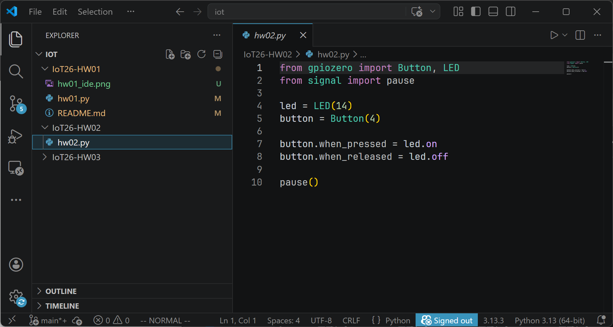

# IoT26-HW02

## Code
[hw02.py](./hw02.py)
```py
from gpiozero import Button, LED
from signal import pause

led = LED(14)
button = Button(4)

button.when_pressed = led.on
button.when_released = led.off

pause()
```
## Screenshot

## Video
https://youtu.be/Q5wD4qz5Vtk